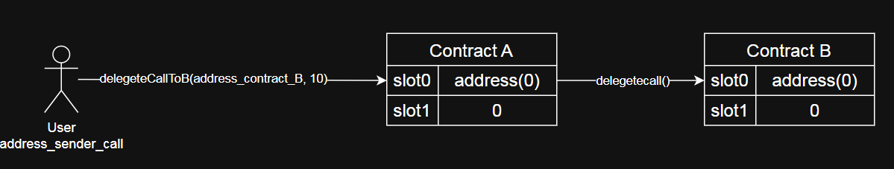
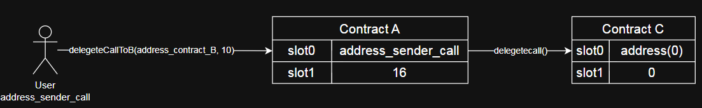

# Upgrading Smart Contract

# Introduction

Once a smart contract deployed to the network, it becomes immutable and persists indefinitely. While this immutability is one of Blockchain’s fundamental strengths, it can also present a significant limitation in certain scenarios.

For instance, consider a developer who discovers a critical vulnerability in their smart contract’s logic. If left unaddessed, this vulnerability could be exploited by malicious actors, causing substantial loss. The developer now faces a dilemma: how to patch the vulerability while preserving the contract’s entire state and data history?

A conventional approach would involve backing up the old contract’s state off-chain, deploying a patched version, and then migrating the backed-up data to the new contract. However, this method has several significant drawbacks: 

- **Scalability issues:** this is only feasible for contracts with a relatively small amount of state data.
- **Code complexity:** the new contract requires a dedicated data migration function, which clutter the codebase and introduces potential security ricks.
- Uses a lot of gas

Therefor, the  challenge arises: How can we update the execution logic of a long-running, data-heavy deployed contract to a safer version without redeploying a new instance and performing a costly data migration? The industry has developed an elegant solution to this problem by leveraging the unique properties of the `delegatecall()` opcode.

# Core concepts

## DelegateCall

As you know, in Solidity there are several ways to make `low-level` calls from `contractA` to `contractB`, including: 

- `call()`
- `staticcall()`
- `delegatecall()`

In this context, `delegatecall()` operates in a unique manner: When `contractA` executes  a `delegatecall()` to `contractB`, it executes the logic of `contractB` but within the `context and Storage of contractA`. Consider the following source code example.

```solidity
contract A {
  address public sender;
  uint256 public balance;
  function delegateCallToB(address _contractLogic, uint256 _balance) external {
      (bool success, ) =  _contractLogic.delegatecall(
        abi.encodePacked(bytes4(keccak256("setBalance(uint256)")), _balance)
      );
      require(success, "Delegatecall failed");
  }
}
```

```solidity
contract B {
  address public sender;
  uint256 public balance;
  function setBalance(uint256 _balance) external {
      sender = msg.sender;
      balance = _balance;
  }
}
```

Both contracts A and B declare the variable `_balances`. Contract A has a function called `delegateCallToB()` which `delegatecall()`  to B’s `setBalance()` function.

We then deploy two contracst to the network:

- Using a specific `address_sender_call` call the `delegateCallToB()` function of contract A with parameters beging the deploy address of B and an interger, for example, 10 ⇒ `delegeteCallToB(address_contract_B, 10)`
- Querying the `sender` and `balance` of B yields the results: `address(0)` and `0`.
- Querying the `sender` and `balance` of A yields the results: `address_sender_call` and `10`.

Before calling:



After the call:


If we now deploy another C contract with the following source code:

```solidity
contract C {
    address public sender;
    uint256 public balance;
    function setBalance(uint256 _balance) external {
        sender = msg.sender;
        balance = balance + _balance * 2;
    }
}
```

Execute:

- Call `delegeteCallToB()` function of A with parameters beging `address_contract_C`and `3`⇒ `delegeteCallToB(address_contract_C, 3)`
- Querying sender and balance of C yields the result: `address(0)` and `0`.
- Querying sender and balance of A yields the result: `address_sender_call` and `16`.

Before calling


After the call:



## Proxy Patterns

When designing upgradable smart contract., gas efficiency is critical for users interacting with  the  contract. There are two common upgrade patterns: **UUPS (Universal Upgradeable Proxy Standard)** and  the **Transparent Upgradeable Proxy.** While both enable upgradability, the UUPS pattern is generally more gas efficient for users.

### Transparent Proxy


The Transparent Proxy Pattern is a design pattern used to create Upgradeable Smart Contracts. It is currently the most popular and safest standard (used by default by Openzeppelin).

1. **Main Purpose: Solving “Selector Clash”**

The biggest issue with Proxies is: if the Proxy and Contract Logic have two functions with the same name (or the same function selector hash), the Proxy won’t know which one to execute.

The Transparent Proxy solves this using a “Sender-based Branching” rule:

1. **Mechanism (The IF-ELSE logic)**

The Proxy checks `msg.sender` (the caller) to decide the execution path:

- If the Admin calls:  The Proxy **intercepts** the call to handle administrative tasks (like `upgradeTo`, `changeAdmin`). The Admin **cannot** call functions in the Logic Contract.
- If the User calls:  The Proxy **forwards (fallbacks)** the call entirely to the Logic Contract. Users **cannot** access the Proxy's administrative functions.

⇒ This is called "Transparent" because Users never see the admin functions, and the Admin is never mistaken for a logic caller.

1. **Key Component: `ProxyAdmin`**

Allowing the Admin to be a regular wallet (EOA) interacting directly with the Proxy is inconvenient (because the Admin address would be blocked from testing logic functions). Therefore, this pattern introduces a third contract called **`ProxyAdmin`**.

- **Standard Flow:** `Dev(Multisig)` -> calls `ProxyAdmin` -> calls `TransparentProxy`.
- This is why your deployment script always automatically generates an additional `ProxyAdmin` contract.

**Summary:** The Transparent Proxy completely separates Admin and User permissions, ensuring you can upgrade code without worrying about function clashes or data conflicts.

### UUPS


1. **Core Difference: "Where does the Upgrade Logic live?"**

Unlike the Transparent Proxy (where the `upgradeTo` logic resides in the **Proxy**), in UUPS, the upgrade logic resides directly in the **Implementation (Logic Contract)**.

- **Transparent Proxy:** The Proxy holds the power to decide where to point next.
- **UUPS:** The Logic Contract itself holds the power to decide "what version I will become next."
1. **Major Advantages (Why use it?)**
- **Ultra Gas Efficient:** Because the Proxy is extremely simple (it only has the `delegatecall` function), the deployment cost for the Proxy is much cheaper than that of a Transparent Proxy.
- **Flexibility:** You can remove the upgrade capability in the future (by simply not including the upgrade function in the final Logic version), effectively making the contract immutable.
1. **The "Deadly" Risk (Bricking)**

Since the upgrade logic is inside the Implementation:

- If you deploy **Logic V2** but **forget to inherit the UUPS module** or **forget to include the upgrade function**.
- => The Proxy will successfully upgrade to V2, but it will then **permanently lose the ability to upgrade to V3**. The contract is effectively "Bricked."

### Gas Analysis:

| **Proxy Pattern** | **Gas Consumption per Call** |
| --- | --- |
| Transparent Proxy | Higher due to repeated `msg.sender == admin` checks  |
| UUPS Proxy | Lower, as admin check occur only during upgrade |

For upgradable smart contracts, **UUPS Proxy** are preferred for their gas efficiency during standard function calls, as they avoid unnecessary admin checks. This reduction in overhead can be significant, especially in contracts with frequent user interactions

## Storage Layout

1. **The Concept: "Numbered Cabinet Drawers"**

Imagine the memory (Storage) of a Smart Contract as a **gigantic medicine cabinet**, with billions of drawers numbered 0, 1, 2, ... (called **Slots**). Each drawer can hold 32 bytes of data.

When you declare variables in Solidity, the compiler assigns them to these slots based on the **order of declaration**.

```solidity
contract Box {
    uint256 public val;      // -> Slot 0
    address public owner;    // -> Slot 1
    bool public isActive;    // -> Slot 2 (occupies part of it, the rest is empty)
}
```

1. **Why does it matter for Proxies?**

In the Upgradeable model:

- **Proxy:** Is the **Real Cabinet** (where the data is actually stored).
- **Implementation (Logic):** Is the **Map/Blueprint** (code that defines which drawer is named what).

When you Upgrade from V1 to V2, you swap in a new "Map," but the "Cabinet" (Proxy) remains exactly the same.

1. **The Disaster: "Storage Collision"**

This is the error you encountered in your previous questions.

If the V2 map **changes the order** or **inserts** a variable into the position of an old variable, the Proxy gets confused. It will read old data from Slot 0 but interpret it as the new variable.

**Error Example:**

- **V1 (Old Map):**
    - Slot 0: `uint256 value` (Currently holds `100`).
- **V2 (New Map - You inserted `name` at the top):**
    - Slot 0: `string name`.
    - Slot 1: `uint256 value`.

=> **Consequence:** When V2 reads the `name` variable (Slot 0), it finds the number `100`. It tries to decode `100` into a string -> **Data Corruption**. Meanwhile, `value` (now at Slot 1) is empty -> **Data Loss**.

### 4. The Golden Rule: "Append Only"

To be absolutely safe when writing V2, V3...:

1. **Never delete old variables:** Even if unused, leave them there (or rename them to `deprecated_variable`).
2. **Never change the order of old variables.**
3. **Never change data types** (e.g., changing `uint256` to `address` is fatal).
4. **New variables must always be declared at the bottom.**

```solidity
// V1
contract BoxV1 {
    uint256 public value; // Slot 0
}

// V2 - Upgrade
contract BoxV2 is BoxV1 {
    // The 'value' variable (Slot 0) is inherited, position preserved
    
    address public owner; // Slot 1 (New variable added at the end)
}
```

1. **Advanced Technique: Storage Gaps (`__gap`)**

Major libraries (like OpenZeppelin) often reserve a large empty space (usually 50 slots) at the end of parent contracts.

```solidity
uint256[50] private __gap;
```

**Purpose:** This allows the library itself to add new variables in future updates (filling the `__gap`) without shifting the storage slots of your child contract (your contract). This protects your storage layout from being messed up when the underlying library upgrades.

# Implementation Guide

## Installation

After created project with hardhat version 3 beta:

```bash
npm install @openzeppelin/contracts
```

## Getting started

First, inside our `contracts` directory, we’ll create a file called `LogicV1.sol`

```solidity
// SPDX-License-Identifier: MIT
pragma solidity ^0.8.22;

import  "@openzeppelin/contracts/proxy/utils/Initializable.sol";

contract LogicV1 is Initializable {
  uint256 public value;
  function initialize(uint256 _value) public initializer {
    value = _value;
  }

  function setValue(uint256 _value) public {
    value = _value;
  }
}
```

This is the contract that we’ll be upgrading.

Let’s go ahead and create our upgraded version of this contract in new file called `LogicV2.sol`

```solidity
// SPDX-License-Identifier: MIT
pragma solidity ^0.8.22;

import "./LogicV1.sol";

contract LogicV2 is LogicV1 {
  function increment(uint256 _value) public {
    value = value + _value;
  }
}
```

We need to config `hardhat.config.ts`

```tsx
import { defineConfig } from "hardhat/config";

export default defineConfig({
  solidity: {
    npmFilesToBuild: [
      "@openzeppelin/contracts/proxy/transparent/ProxyAdmin.sol",
      "@openzeppelin/contracts/proxy/transparent/TransparentUpgradeableProxy.sol",
    ],
  },
});
```

## Writing Ignition Module

### Deploying Proxies

```tsx
import { buildModule } from "@nomicfoundation/hardhat-ignition/modules";

export default buildModule("LogicV1", (m) => {
  const admin = m.getAccount(0);
  const initValue = m.getParameter("initValue", 22);
  const logicV1 = m.contract("LogicV1");

  const initData = m.encodeFunctionCall(logicV1, "initialize", [initValue]);

  const proxy = m.contract("TransparentUpgradeableProxy", [
    logicV1,
    admin, // admin
    initData, // encoded initialize data
  ]);

  const proxyAdminAddress = m.readEventArgument(
    proxy,
    "AdminChanged", // first occurrence
    "newAdmin",
  );

  const proxyAdmin = m.contractAt("ProxyAdmin", proxyAdminAddress);
  return { proxyAdmin, proxy, logicV1 };
});

```

```bash
npx hardhat ignition deploy ignition/modules/LogicV1.ts --network sepolia --verify
```

### Upgrading proxy with an initialization function

```solidity
import { buildModule } from "@nomicfoundation/hardhat-ignition/modules";
import LogicV1 from "./LogicV1.js";

export default buildModule("LogicV2", (m) => {
  const admin = m.getAccount(0);
  const { proxy, proxyAdmin } = m.useModule(LogicV1);
  const logicV2 = m.contract("LogicV2");

  m.call(proxyAdmin, "upgradeAndCall", [proxy, logicV2, "0x"], {
    from: admin,
  });

  return { proxy, proxyAdmin, logicV2 };
});
```

```bash
npx hardhat ignition deploy ignition/modules/LogicV2.ts --network sepolia --verify
```

# Conclusion

# Reference

https://doc.confluxnetwork.org/docs/general/build/smart-contracts/gas-optimization/uupsAndTransparentProxy

[https://github.com/KienPT0610/upgrades-contract](https://github.com/KienPT0610/upgrades-contract)